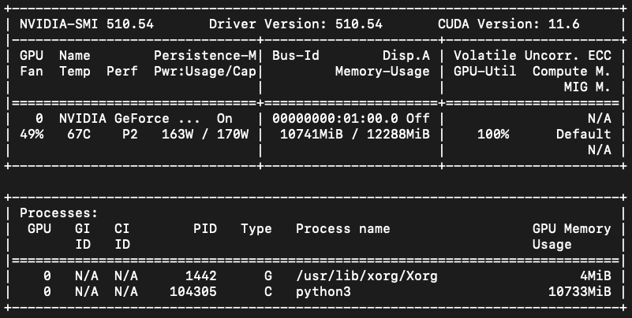

# CIFAR10_UCI_CS273A_Final_Project
Winter 2022 UCI CS273A Machine Learning Final Project

## Prerequisite
- An NVIDIA GPU
- Enable GPU with docker
- Familiar with Pytorch 

## Our Enviroment
- Hardware: NVIDIA GEFORCE RTX 3060



## Run the program
### Step 1. Build the image 
```
cd cifar10-uci-cs273a-final-project
docker build . -t final
```
### Step 2. Run the container with gpu and mount all project to the container
```
docker run --gpus all -v $(pwd)/.:/source/. -it final /bin/bash
```

### Step 3. Inside the container, run train.py
```
python3 train.py
```
We implement 4 different deep learning neaural network: basic CNN, RestNet, GoogleNet, VGGNet to do the image classfication for CIFAR10. Please check the source code for further imformation.

### Step 4. Evaluate each models with test images
```
python3 test.py
```

## Useful Links
- [Get Docker](https://docs.docker.com/engine/install/ubuntu/)
- [How to Use the GPU within a Docker Container](https://blog.roboflow.com/use-the-gpu-in-docker/)
- [NVIDIA Container Toolkit](https://github.com/NVIDIA/nvidia-docker)
- [Docker Images with Pytorch](https://hub.docker.com/r/pytorch/pytorch/tags)
- [Pytorch Tutorial](https://pytorch.org/tutorials/beginner/blitz/cifar10_tutorial.html)

## Reference
- [pytorch-cifar10](https://github.com/soapisnotfat/pytorch-cifar10)
- [pytorch-cifar](https://github.com/kuangliu/pytorch-cifar)
- [CIFAR10-img-classification-tensorflow](https://github.com/deep-diver/CIFAR10-img-classification-tensorflow)
